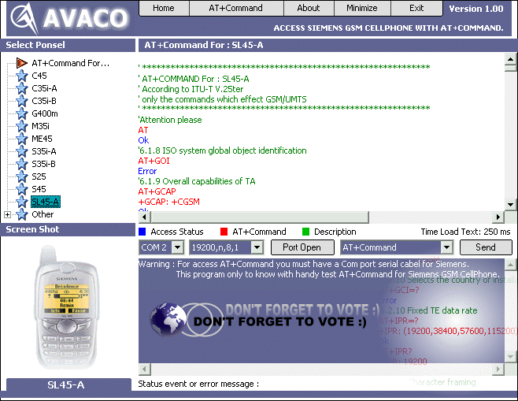



## Avaco \- \[New \! Access Siemens GSM CellPhone With Full AT\+Command\]

### Description

This is a full AT+Command for access siemens GSM CellPhone. This program only to know with handy test AT+Command for Siemens.

With this program you can know how to access siemens with AT+Command.

For example : AT+CGMI = output [SIEMENS], AT+CGMM = output [C45], Access Midi (sound) = AT^SBNW="mid",0,1 > 4D5468640000000..... (CTRL-Z)

, Access Logo = example : AT^SBNW="bmp",0,0 and any other.
 
### More Info
 

             |
---                |---
**Submitted On**   |2002-10-03 04:35:30
**By**             |[oom avaco](https://github.com/Planet-Source-Code/PSCIndex/blob/master/ByAuthor/oom-avaco.md)
**Level**          |Advanced
**User Rating**    |4.7 (109 globes from 23 users)
**Compatibility**  |VB 6\.0
**Category**       |[Complete Applications](https://github.com/Planet-Source-Code/PSCIndex/blob/master/ByCategory/complete-applications__1-27.md)
**World**          |[Visual Basic](https://github.com/Planet-Source-Code/PSCIndex/blob/master/ByWorld/visual-basic.md)
**Archive File**   |[Avaco\_\-\_\[N1403931042002\.zip](https://github.com/Planet-Source-Code/oom-avaco-avaco-new-access-siemens-gsm-cellphone-with-full-at-command__1-39444/archive/master.zip)

